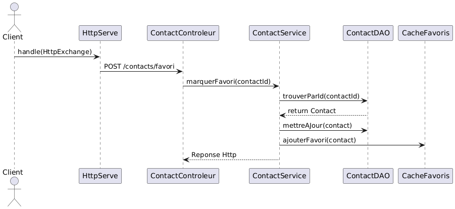

# Présentation de l'Application


Mes chums est un service web concu  pour la gestion des contacts en fonction de leurs adresses. On peut marquer des contacts comme favoris, ou ajouter de nouvelles adresses à des contacts existants, et de rechercher des contacts situés à proximité d’une position géographique donnée.

### Fonctionnalités principales :
- Ajouter un contact (avec une ou plusieurs adresses)
- Ajouter une adresse à un contact existant
- Marquer un contact comme favori ou retirer le favori
- Rechercher un contact par ID
- Trouver des contacts à proximité d’une position donnée (géolocalisation)

### Technologies utilisées :
- Langage de programmation :** Java pour gérer les fontionnements de l'application puis SQL pour communiquer avec notre base de données
- Gestionnaire de projet & dépendances :** Maven (pom.xml pour définir les dépendances)
- Communication HTTP :  fourni par le JDK

- Utilisation de API de Géocodage Nominatim (OpenStreetMap) pour convertir une adresse texte en coordonnées GPS


## 1. Endpoints REST


- ### Ajouter un nouveau contact avec ses adresses. POST /contacts avec le requestbody suivant :
```json
{
  "nom": "nom",
  "prenom": "prenom",
  "favoris": false,
  "adresse": [
    {
      "rue": "rue",
      "ville": "ville",
      "codePostal": "X0X0X0",
      "pays": "pays"
    }
  ]
}
```


- ### Ajouter une ou plusieurs adresses à un contact existant.Envoyer la requete POST /contacts/ avec le reuestbody suivant:

```json
{
  "contactId": 1,
  "adresses": [
    {
        "rue": "rue",
        "ville": "ville",
        "codePostal": "X0X0X0",
        "pays": "pays"
    }
  ]
}
```

- ### Marquer un contact comme favori.Faire un POST /contacts/favori avec le requestbody suivant: **{ "id": 1 }**


- ### Retirer le statut favori d’un contact DELETE /contacts/favori avec le requestbody suivant: **{ "id": 1 }**


- ### Rechercher un contact par ID. Envoyer la requete POST /contacts/rechercher avec l'id du contact dans le requestbody suivant: **{ "id": 1 }**


- ### Trouver les contacts à proximité d’une position géographique donnée. Faire un POST /contacts/proximite avec les coordonnées de ma position actuelle dans le requestbody suivant: 

```json
{
  "latitude": 45.5017,
  "longitude": -73.5673,
  "rayon": 10
}
```


## 2. Architecture Logicielle

L’architecture suit une séparation en couches :

### Couche Présentation (Contrôleur) :
- `ContactControleur` intercepte les requetes et traite les échanges en le redigeant , le controleur utilise `ObjectMapper` pour  sériliser/désérialiser le JSON, puis appelle la couche Service.

### Couche Service (Logique Métier) :
Contient les règles métier.
ContactService permet de gérer les
  - Ajout , modification et recherche de contact : appelle le DAO, géocode les adresses, met à jour la cache si besoin.
  -
  - Marquage favoris : met à jour le contact et la cache.
  - Recherche proximité : parcourt les contacts et calcule les distances.

### Couche DAO (Accès aux Données) :
Gère la persistance en BD via JDBC.
- **Exemple :** `ContactDAO`, `AdresseDAO` implémentent `DAOGenerique<T>` pour CRUD.

### DTO & Mapper :
- **DTOs :** (`ContactDTO`, `AdresseDTO`) Formats de données pour (dé)sérialisation JSON.
- **Mappers :** (`ContactMapper`, `AdresseMapper`) Convertissent entre DTOs et modèles.

---

## 3. Mécanisme de Cache

La cache  est une HashMap de format `Map<Contact, List<Coordonnees>` qui stocke les coordonnées des contacts favoris. Cela évite d,utiliser un DAO pour le calcul de proximité.




## 4. Utilisation de la Géolocalisation

- L’application utilise une API de géocodage (Nominatim) pour convertir une adresse en coordonnées GPS. J'ai choisis cette API puisqu'elle est plus simple que celles offertes par Google or OpenWeatherMap. Elle utilise la biblio Okhttp3 et on peut l'appeler directement sans utiliser de clé api.

- Exemle: lorsqu'on veut ajouter des adresses a un contact on appelle l'API pour convertir les adresses saisies en coordonnees 
```java
public void ajouterAdressesAuContact(int contactId, List<Adresse> adresses) {
    for (Adresse adresse : adresses) {
        // Appel de notre API
        Coordonnees coords = apiGeocodage.obtenirCoordonneesPourAdresse(
            adresse.getRue(), adresse.getVille(), adresse.getCodePostal(), adresse.getPays()
        );
        adresse.setCoordonnees(coords);
    }

    contactDAO.ajouterAdressesAuContact(contactId, adresses);
}
```
- Cet API rentre de facon indirecte dans le fonctionnement de la recherche en proximité puisque elle permet l'utilisation de la formule de Haversine


## 5. Injection de Dépendances (optionnel)

Principales Dépendances
Jackson (JSON) qui permet de sérialiser et désérialiser le JSON.
 afin de faire les convertions JSON des requêtes HTTP / entités Java.

Dépendance Maven :

```xml
<dependency>
    <groupId>com.fasterxml.jackson.core</groupId>
    <artifactId>jackson-databind</artifactId>
    <version>2.15.2</version>
</dependency>

```
SQLite JDBC Driver
Rôle : Permet de se connecter à une base de données SQLite via JDBC.
Utilisation dans le projet : Le DAO utilise JDBC pour insérer, mettre à jour, supprimer et lire les données dans mes_chums.db.
Dépendance Maven :

```xml
<dependency>
    <groupId>org.xerial</groupId>
    <artifactId>sqlite-jdbc</artifactId>
    <version>3.36.0.3</version>
</dependency>
```
OkHttp pour traiter les requêtes avec l'API de géocodage Nominatim
Dépendance Maven :

```xml
<dependency>
    <groupId>com.squareup.okhttp3</groupId>
    <artifactId>okhttp</artifactId>
    <version>4.9.3</version>
</dependency>
```
